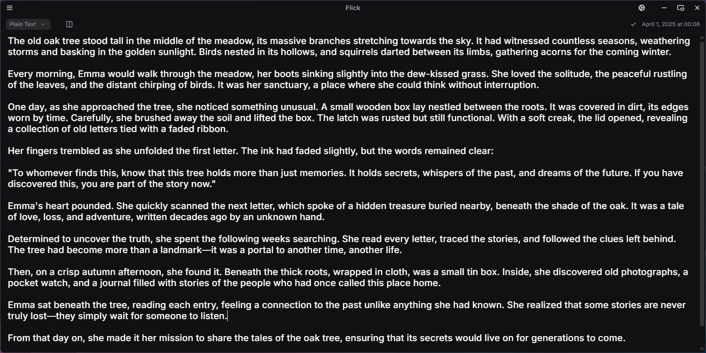
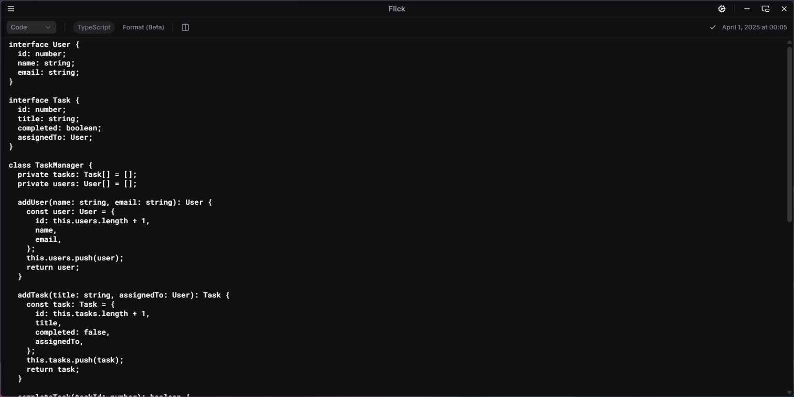
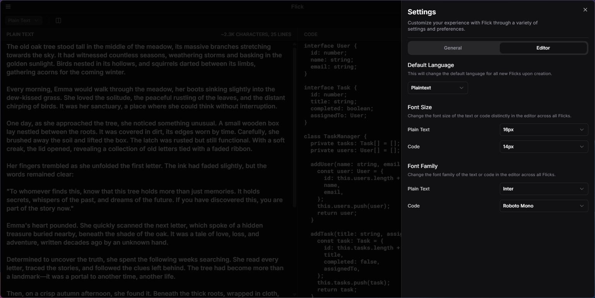

# Flick

<p align="center">
  
</p>

<p align="center">
A beautifully simple note-taking application for your desktop. Flick lets you capture thoughts and code snippets with an elegant, distraction-free interface.
</p

## Features

- **Dual Editing Modes**: Switch seamlessly between Plain Text and Code modes
- **Intelligent Language Detection**: Automatic syntax highlighting for your code snippets
- **Experimental Formatting**: Clean and organized code display
- **Automatic Saving**: Focus on your thoughts, not on saving your work
- **Native Performance**: Built with Tauri for excellent speed and small footprint

## Screenshots

#### Plain Text



#### Code



#### Settings



## Installation

### Download Pre-built Binaries

Download the latest release for your platform from the [Releases page](https://github.com/kerdofficial/flick/releases).

Available for:

- Windows (x64)
- Support for macOS and Linux coming soon

### Self-hosting

Want to build and host Flick yourself? Follow these steps:

#### Prerequisites

- [Node.js](https://nodejs.org/) (v18 or newer)
- [Rust](https://www.rust-lang.org/tools/install) (latest stable)
- [Tauri CLI](https://tauri.app/v2/guides/getting-started/setup/cli/)

#### Steps to Build

1. Clone the repository

   ```
   git clone https://github.com/kerdofficial/flick.git
   cd flick
   ```

2. Install dependencies

   ```
   pnpm install
   ```

3. Build for development

   ```
   pnpm tauri dev
   ```

4. Build for production
   ```
   pnpm tauri build
   ```

The compiled application will be available in the `target/release` directory. Windows executables will be in the `target\release` folder on Windows systems.

## Development

### Tech Stack

- **Frontend**: React with TypeScript
- **Styling**: Tailwind CSS v4
- **Desktop Framework**: Tauri v2
- **UI Components**: Custom + shadcn/ui

### Commands

- `pnpm dev` - Start the development server (web only)
- `pnpm tauri dev` - Start the development app with Tauri
- `pnpm build` - Build the web app
- `pnpm tauri build` - Build the desktop app

## Contributing

Contributions are welcome! Feel free to submit issues or pull requests.

## License

[Modified MIT](LICENSE) © KerD  
This project is licensed under the MIT License with additional restrictions. See the [LICENSE](LICENSE) file for details.

---

Made by [KerD](https://github.com/kerdofficial)
